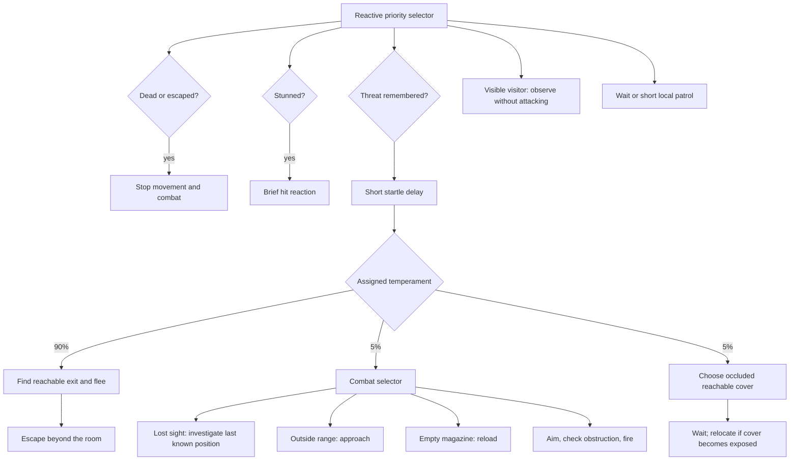

# NPC behaviour test

Open **Tools > Top Down Shooter > Open NPC Lab** and press Play. You start with a
pistol in the entrance below the room. Walk inside and fire. The green corridors
on the left and right are exits; the purple blocks are solid cover.

- **F2:** show live state labels and the population settings.
- **F6:** reset the encounter and redistribute temperaments.
- **Enter after defeat:** respawn and reset the encounter.
- Select an NPC in Play Mode to inspect its live behaviour tree. Cyan nodes are
  running, green succeeded, orange failed, grey were not visited on that tick.
  Selected NPCs also show their route and remembered threat position in Scene view.

## Population and decisions

`NpcRoom` defaults to **90 flee / 5 fight / 5 hide**. These are population weights,
not a fresh random roll on every gunshot. Largest-remainder allocation creates
exactly 18 fleeing, 1 fighting and 1 hiding NPC in the 20-person demonstration.
The assignment is shuffled from a seed once per encounter. In a smaller room,
rounding means some rare roles can be absent. A zero-weight configuration falls
back to fleeing.

The actual runtime tree is implemented by `Selector`, `Sequence`, `Condition` and
`TaskNode` in `NpcBehaviourTree.cs`. It reevaluates priority at 10 Hz; physics and
animation continue at their normal update rates. The combat selector has separate
investigation, approach, reload and aim/fire nodes.

## Perception and movement

NPCs notice visible visitors but do not attack before a shot or injury. A shot
inside their home room alerts the room, including people behind cover. Outside
that room, hearing uses distance and halves the hearing range through walls.
NPC shots do not repeatedly re-trigger the civilian alarm.

Sight requires range, a clear wall ray, and a forward field of view while calm.
Alarmed NPCs look around in all directions. Only sight or new sound updates the
remembered position; combatants do not track an unseen player's live position.
Without another sound or sighting, threat memory expires after ten seconds.

`NpcNavigationGrid` bakes static colliders and permitted walk areas into a shared
grid. A* routes around walls and forbids diagonal corner cutting. People use
dynamic colliders and local separation; they are not baked as permanent walls.
Routes refresh periodically. Cover must block the line to the remembered threat
and have a reachable path. If there is no cover, a hider tries an exit. If neither
is reachable, it holds position instead of moving through a wall.

## Combat and tuning

The fighter has a pistol, an aiming delay, an eight-round magazine and a reload.
It checks for bystanders before firing and can damage the player. NPCs can be
stunned and killed by the player's guns or melee attacks. The player has five hit
points in this test. Death stops movement and combat.

Edit population weights on `NpcRoom`; speeds, vision, hearing, health and memory
on `NpcBrain`; cell size, permitted rectangles and clearance on
`NpcNavigationGrid`. Area rectangles use world coordinates. Add exit and cover
transforms to the room arrays. Parent NPCs under the room and assign their room
reference when using `Assets/CharacterLab/EnemyNpc.prefab` elsewhere. Rebake the
grid after changing static obstacles at runtime; it is baked on encounter reset.

This is the first NPC system: one-room escape/cover tactics, basic pistol combat
and short patrols. It does not yet include doors, squad coordination or a full
stealth investigation system.

## Player fixes and feedback

The two leg sections remain collinear. They foreshorten along the travel axis
around fixed hips, with no lateral knee rotation. Animation fades into the exact
idle silhouette at rest.

Each weapon has a measured barrel tip in atlas pixels. The held sprite's muzzle
transform supplies the bullet origin, barrel direction and flash position. Mouse
aim converges from this offset muzzle onto the cursor. A separate body-to-muzzle
check prevents a barrel clipping through a thin wall from shooting past it.

Each successful shot emits one event for sound, camera shake and NPC hearing.
The shotgun's pellets do not multiply these effects. Shake is bounded and decays
quickly; its offset is removed from cursor-to-world aiming. Adjust `shakeStrength`
and `shakeDuration` on `CharacterTestCamera`, and volume on `ShotFeedback`.

The three original generated retro effects are in `Assets/Audio/Retro` (pistol,
shotgun, automatic). They use short noise/transient envelopes, low pitched impact
tones and coarse quantization. They are 22.05 kHz mono PCM audio files, not literal
64-bit audio. Player effects are centred; NPC effects attenuate with distance.

## Validation

`CharacterLabValidation.Run` checks straight legs, fixed joints, muzzle origins
at eight angles for all guns, cursor convergence, wall clipping, sound/shake
events and the existing weapon interactions. It also renders walk and muzzle
close-ups.

`NpcLabValidation.Run` checks allocation, reactive tree priority, perception,
navigation, physical crowd evacuation, occluded cover, friendly obstruction,
real return fire, damage, death and encounter reset. Both run in a separate Unity
project copy so the open working project is not interrupted.
